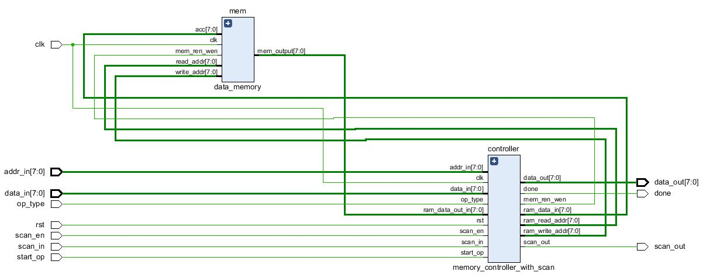
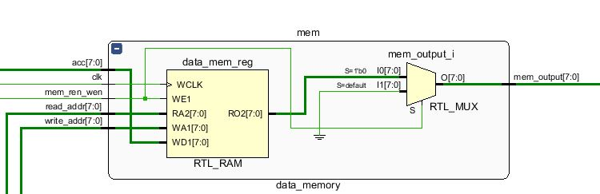
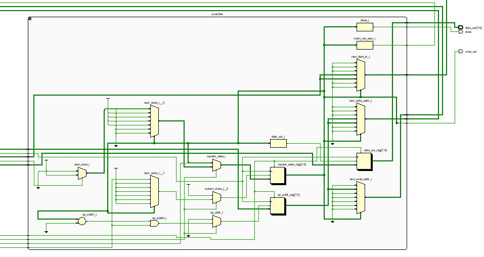

# ScanChain-DFT-MemoryController

Hi friends! 👋  
This project implements a **Memory Controller with Scan Chain**, ideal for a CPU data path, featuring **built-in testability**.

---

## ✨ Features

- **6-State FSM** provides synchronous, reliable control for memory read and write cycles.  
- **3-bit Scan Chain** implemented on the state register enables external **ATE verification** via serial shifting.  
- **Hazard Prevention Logic** ensures data stability and avoids **Read-After-Write (RAW)** issues.

---

## 📸 Visuals

### 🧩 Top-Level Schematic
**Figure:** Overall design showing controller and memory connection.  

---

### ⚙️ Memory Layout
**Figure:** Memory Model.  

---

### ⚙️ Memory Controller FSM
**Figure:** Internal logic and state transitions of the controller.  

---

Thank you!! 🤜🤛
